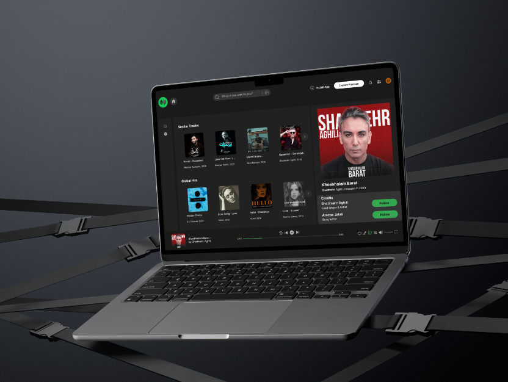
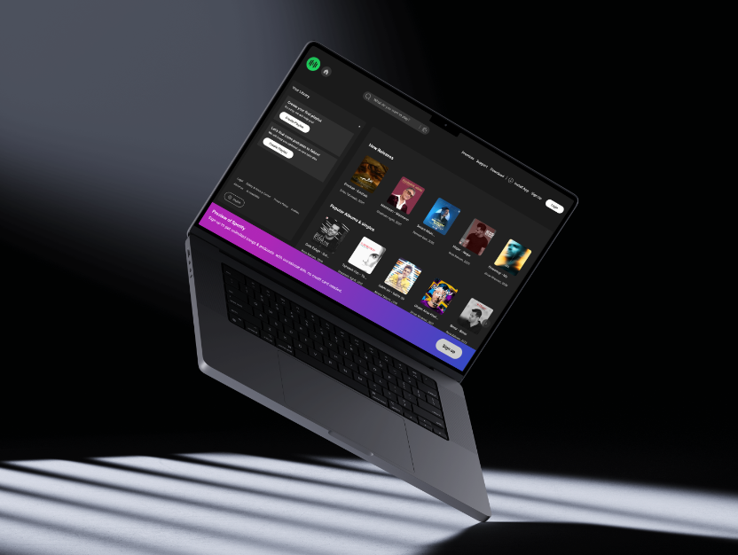
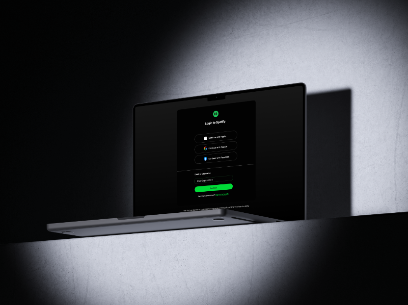
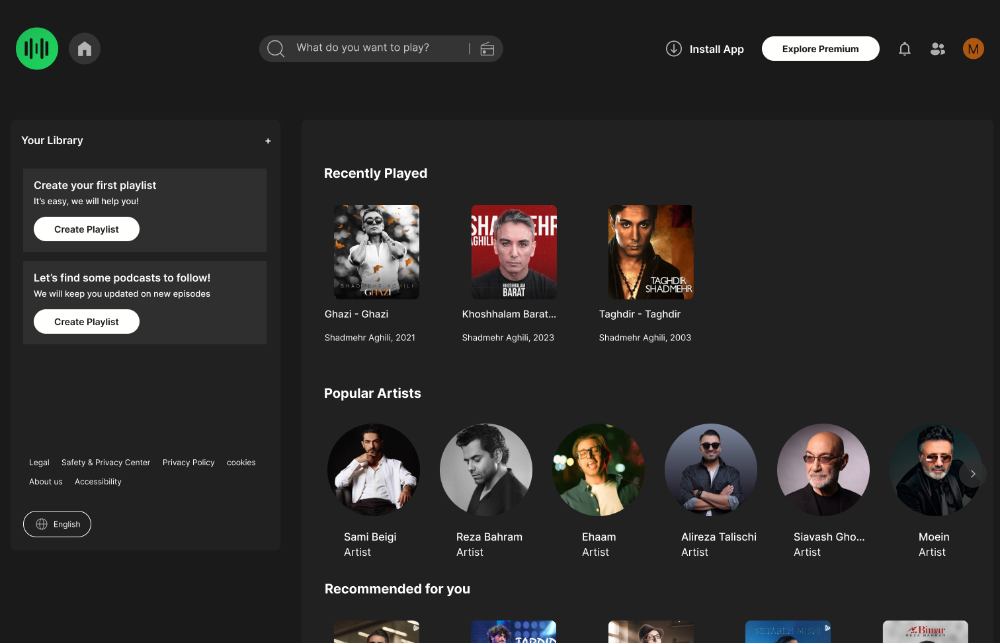

# 🎵 Music Streaming Platform - UI/UX Case Study

A comprehensive UI/UX redesign concept of a music streaming web player, showcasing the transition from initial low-fidelity wireframes to polished, modern high-fidelity mockups.

<!-- Professional Badges (LinedIn, Instagram, Figma Link) -->

  
  
  

<!-- Hero Mockup Showcase -->

  

---

## 🚀 Project Overview
This project focuses on designing a dark-themed, highly intuitive user interface for a localized music streaming experience. The design principles emphasize clean visual hierarchy, smooth navigation, and a modern aesthetic suited for music enthusiasts.

### ✨ Key Design Features:
- **Clean Dark UI:** Reduces eye strain and keeps the focus on artist artwork.
- **Visual Consistency:** Consistent component design (cards, buttons, sidebars) across all views.
- **Process-Driven:** Developed carefully from scratch, moving from structural wireframes to realistic presentations.

---

---

## 🎨 Design Process (Low-Fi vs. High-Fi)

To ensure a solid user experience, the project started with structured wireframes (Low-Fi) before moving to the visual design phase (High-Fi).

### 1. Landing Page
| Low-Fidelity Wireframe | High-Fidelity Design |
| :---: | :---: |
|  |  |

---

### 2. Login Page
| Low-Fidelity Wireframe | High-Fidelity Design |
| :---: | :---: |
|  |  |

---

### 3. User Homepage / Web Player
| Low-Fidelity Wireframe | High-Fidelity Design |
| :---: | :---: |
|  |  |

---

### 4. Song Detail Page
| Low-Fidelity Wireframe | High-Fidelity Design |
| :---: | :---: |
|  |  |

---

## 🛠️ Tools Used
- **Figma** — Wireframing, UI Design, and Prototyping

